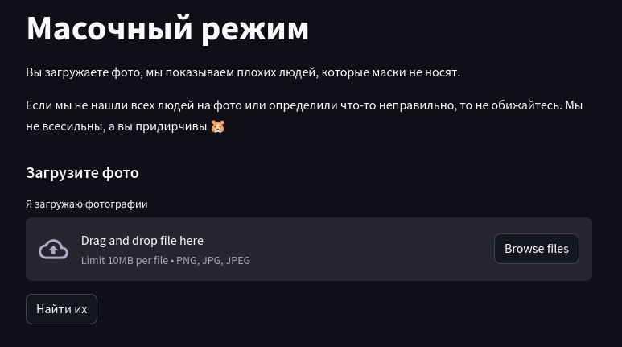
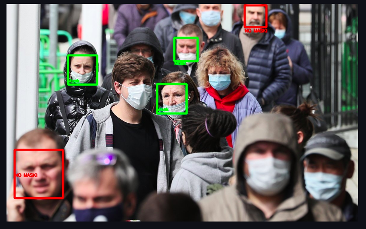
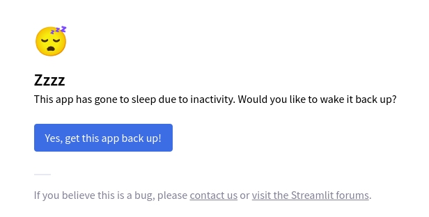

# Масочный режим
Приложение по фото определяет тех, кто носит, а кто не носит маски на фото.

Воспользоваться им можно по ссылке - https://face-mask-detection-project.streamlit.app/

### Пример работы приложения

### Приложение не отображается
Если приложение не отображается, нажмите на кнопку перезагрузки на экране - после пары минут оно станет снова доступно.

